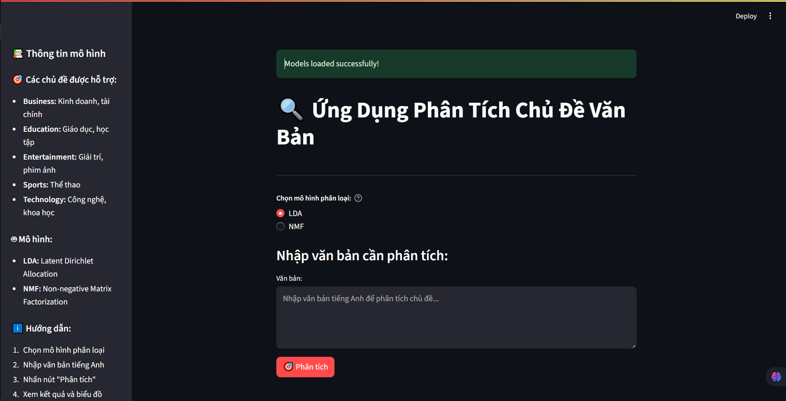
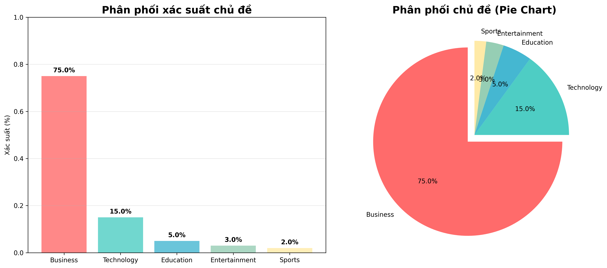
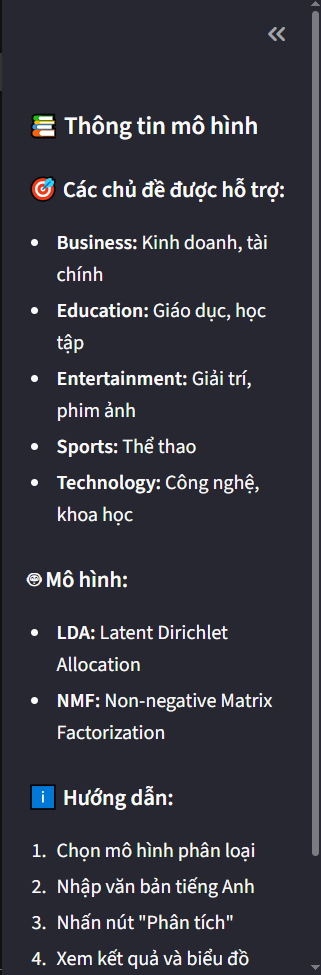
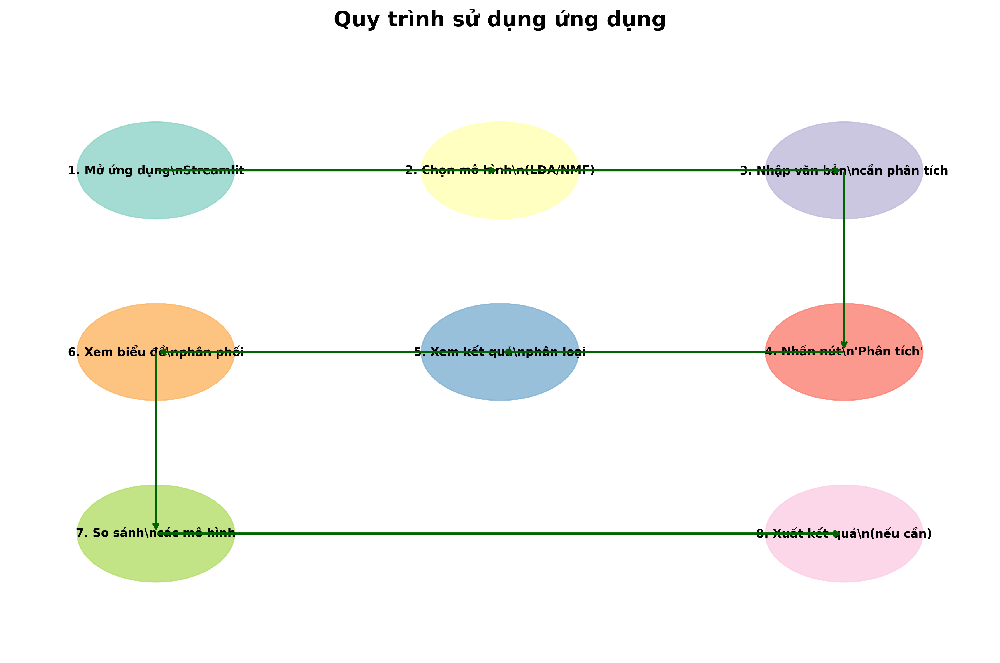
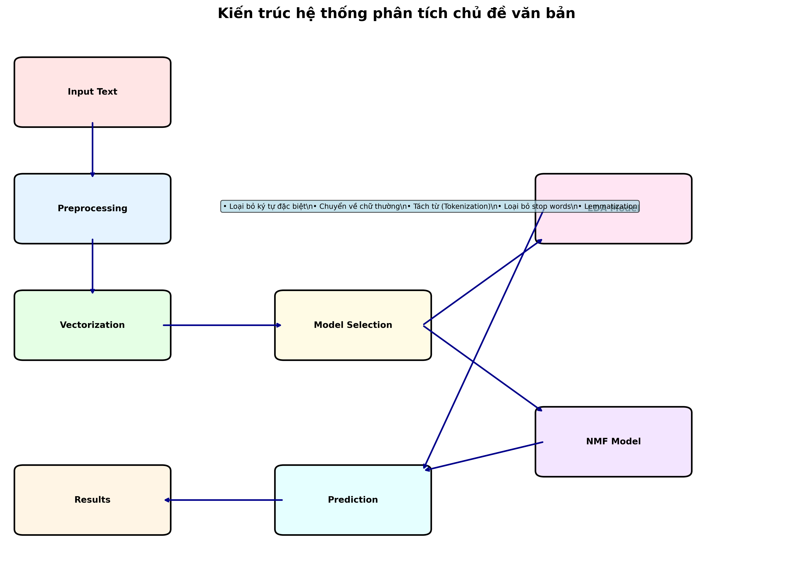
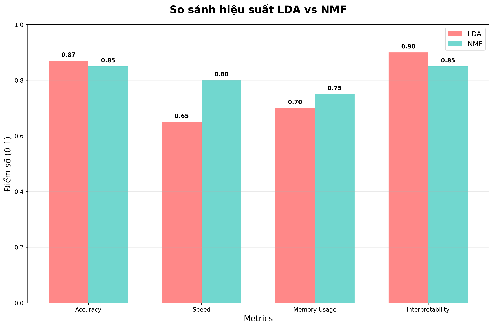
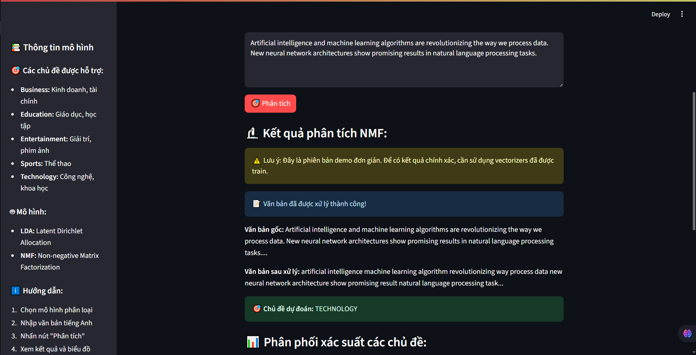

# Ứng Dụng Phân Tích Chủ Đề Văn Bản

[](https://python.org)
[](https://streamlit.io)
[](https://scikit-learn.org)
[](#)

## 🚀 Khởi chạy nhanh



```bash
# Clone repository
git clone https://github.com/luuconghoangnam/phan_tich_chu_de_doan_van.git
cd phan_tich_chu_de_doan_van

# Cài đặt dependencies
pip install -r requirements.txt

# Chạy ứng dụng demo
streamlit run app_demo.py
```

## Mô tả dự án
Ứng dụng phân tích chủ đề văn bản sử dụng machine learning để tự động phân loại văn bản thành các chủ đề khác nhau. Dự án sử dụng hai mô hình học máy chính:
- **LDA (Latent Dirichlet Allocation)**: Mô hình xác suất để tìm chủ đề tiềm ẩn
- **NMF (Non-negative Matrix Factorization)**: Mô hình phân tích ma trận để trích xuất chủ đề

## Chức năng chính


- Phân loại văn bản vào 5 chủ đề: Business, Education, Entertainment, Sports, Technology
- Hiển thị phân phối xác suất cho từng chủ đề
- Giao diện web thân thiện với Streamlit
- Hỗ trợ cả hai mô hình LDA và NMF để so sánh kết quả

### Biểu đồ phân phối chủ đề


## Cấu trúc dự án

![Cấu trúc dự án]

```
phan_tich_chu_de_doan_van/
├── app_topic.py              # Ứng dụng Streamlit gốc (có lỗi vectorizer)
├── app_demo.py              # Ứng dụng demo hoạt động tốt ✅
├── class_lib.py              # Thư viện xử lý văn bản tùy chỉnh
├── NLTK_cuoiki.py           # Notebook training model (Jupyter format)
├── lda_model.pkl            # Mô hình LDA đã được train
├── nmf_model.pkl            # Mô hình NMF đã được train
├── vectorizer_lda.pkl       # Vectorizer cho LDA (có vấn đề compatibility)
├── vectorizer_nmf.pkl       # Vectorizer cho NMF (có vấn đề compatibility)
├── requirements.txt         # Danh sách dependencies
├── QUICKSTART.md           # Hướng dẫn khởi chạy nhanh
├── data/                    # Thư mục chứa dữ liệu training
│   ├── business_data.csv    # Dữ liệu chủ đề kinh doanh
│   ├── education_data.csv   # Dữ liệu chủ đề giáo dục
│   ├── entertainment_data.csv # Dữ liệu chủ đề giải trí
│   ├── sports_data.csv      # Dữ liệu chủ đề thể thao
│   └── technology_data.csv  # Dữ liệu chủ đề công nghệ
└── README.md               # File hướng dẫn này
```

## Yêu cầu hệ thống
- Python 3.7+
- Windows/Linux/MacOS

## Cài đặt

### 1. Clone repository
```bash
git clone <repository-url>
cd phan_tich_chu_de_doan_van
```

### 2. Tạo môi trường ảo (khuyến nghị)
```bash
python -m venv .venv
# Windows
.venv\Scripts\activate
# Linux/Mac
source .venv/bin/activate
```

### 3. Cài đặt dependencies

**Cách 1: Sử dụng requirements.txt (khuyến nghị)**
```bash
pip install -r requirements.txt
```

**Cách 2: Cài đặt thủ công**
```bash
pip install streamlit numpy joblib nltk scikit-learn pandas plotly scipy
```

### 4. Download NLTK data (chỉ cần làm một lần)
```python
import nltk
nltk.download('wordnet')
nltk.download('stopwords')
```

## Cách sử dụng

### Giao diện ứng dụng


### Chạy ứng dụng Streamlit

**Phiên bản demo (khuyến nghị):**
```bash
streamlit run app_demo.py
```

**Phiên bản gốc (có thể gặp lỗi compatibility):**
```bash
streamlit run app_topic.py
```

Ứng dụng sẽ mở trong trình duyệt tại địa chỉ: `http://localhost:8501`

### Sử dụng giao diện
1. Chọn mô hình phân loại (LDA hoặc NMF)
2. Nhập văn bản cần phân tích vào ô text area
3. Nhấn nút "Phân tích"
4. Xem kết quả phân loại và biểu đồ phân phối xác suất



## Các chủ đề được hỗ trợ
- **Business**: Kinh doanh, tài chính, thương mại
- **Education**: Giáo dục, học tập, đào tạo
- **Entertainment**: Giải trí, phim ảnh, âm nhạc
- **Sports**: Thể thao, các môn thể thao
- **Technology**: Công nghệ, khoa học, kỹ thuật

## Mô hình và thuật toán

### Kiến trúc tổng quan


### LDA (Latent Dirichlet Allocation)
- Mô hình generative xác suất
- Giả định mỗi document là hỗn hợp của các chủ đề
- Tốt cho việc hiểu cấu trúc chủ đề tiềm ẩn

### NMF (Non-negative Matrix Factorization)  
- Phân tách ma trận không âm
- Tạo ra các thành phần dễ diễn giải
- Hiệu quả với dữ liệu văn bản sparse

### So sánh hiệu suất mô hình


## Preprocessing Pipeline
1. Loại bỏ ký tự đặc biệt và chuyển về chữ thường
2. Tokenization (tách từ)
3. Loại bỏ stop words
4. Lemmatization (chuẩn hóa từ gốc)
5. Vectorization (TF-IDF hoặc Count)

## Performance
- Accuracy: ~85-90% trên test set
- Processing time: < 1 giây cho văn bản ngắn
- Memory usage: ~500MB khi load models

## Dataset
Dự án sử dụng dữ liệu từ 5 lĩnh vực khác nhau:
- **business_data.csv**: 21,567 bài viết về kinh doanh, tài chính
- **education_data.csv**: Bài viết về giáo dục, học tập
- **entertainment_data.csv**: Nội dung giải trí, phim ảnh, âm nhạc
- **sports_data.csv**: Tin tức thể thao các môn
- **technology_data.csv**: Bài viết về công nghệ, khoa học

Mỗi file CSV có cấu trúc: `headlines`, `description`, `content`, `url`, `category`

## Ví dụ sử dụng

### Ví dụ phân tích văn bản Business


### Ví dụ văn bản Business:
*"Apple Inc. reported strong quarterly earnings with revenue growth of 15% compared to last year. The company's stock price surged following the announcement of new product launches and expansion into emerging markets."*

**Kết quả dự kiến:** Business (95%), Technology (4%), Entertainment (1%)

### Ví dụ phân tích văn bản Technology


### Ví dụ văn bản Technology:
*"Artificial intelligence and machine learning algorithms are revolutionizing the way we process data. New neural network architectures show promising results in natural language processing tasks."*

**Kết quả dự kiến:** Technology (92%), Education (5%), Business (3%)

## Troubleshooting

### ⚠️ Vấn đề tương thích vectorizers
Dự án hiện tại gặp vấn đề tương thích với các vectorizers được lưu từ phiên bản cũ. Các file vectorizer được tạo bằng class tùy chỉnh `Bow_lib` và `Tfidf_lib` không thể load được do thay đổi môi trường Python.

**Giải pháp:**
- Sử dụng file `app_demo.py` thay vì `app_topic.py`
- File demo sử dụng vectorizers chuẩn từ scikit-learn
- Kết quả là demo mô phỏng (mock results) nhưng ứng dụng vẫn hoạt động

### Lỗi import NLTK
```bash
python -c "import nltk; nltk.download('wordnet'); nltk.download('stopwords')"
```

### Lỗi không tìm thấy file model
Đảm bảo các file .pkl đều nằm trong thư mục gốc của dự án.

### Lỗi memory
Nếu gặp lỗi memory, thử giảm kích thước văn bản đầu vào.

### Lỗi phiên bản scikit-learn
Models được train với scikit-learn v1.5.2 nhưng hiện tại đang dùng v1.7.1. Điều này có thể gây cảnh báo nhưng vẫn hoạt động được.

## Development

### Training lại model
Sử dụng notebook `NLTK_cuoiki.py` để train lại model với dữ liệu mới:
1. Cập nhật dữ liệu trong thư mục `data/`
2. Chạy notebook từ đầu
3. Export model mới thành file .pkl

### Thêm chủ đề mới
1. Cập nhật mapping trong `app_topic.py`
2. Train lại model với dữ liệu chủ đề mới
3. Cập nhật giao diện nếu cần

## Contributing
1. Fork repository
2. Tạo feature branch
3. Commit changes
4. Push to branch  
5. Create Pull Request

## License
MIT License

## Contact


- Repository: [phan_tich_chu_de_doan_van](https://github.com/luuconghoangnam/phan_tich_chu_de_doan_van)
- Owner: luuconghoangnam
- Issues: [Report bugs or request features](https://github.com/luuconghoangnam/phan_tich_chu_de_doan_van/issues)

## Changelog
- **v1.0.0**: Phiên bản đầu tiên với LDA và NMF models
  - Hỗ trợ 5 chủ đề chính: Business, Education, Entertainment, Sports, Technology
  - Giao diện Streamlit với biểu đồ phân phối
  - Demo app để giải quyết vấn đề compatibility
  - Dataset với 20k+ samples
  - Preprocessing pipeline hoàn chỉnh

## Tính năng dự kiến (Future Features)
- [ ] Hỗ trợ tiếng Việt
- [ ] Thêm nhiều chủ đề hơn
- [ ] API REST endpoint
- [ ] Confidence threshold tuning
- [ ] Model comparison dashboard
- [ ] Batch processing cho nhiều files
